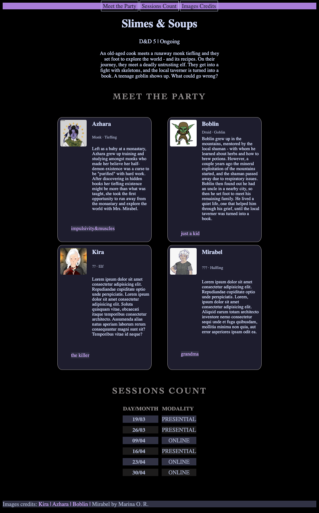

# Slimes & Soups

## Live link and screenshot

[Live demo](https://riverkarnas.github.io/html-css-practice/experiments/meet-my-rpg-party/)

## Purpose
A character showcase page for an ongoing D&D campaign and session tracker built as a frontend practice project

## What I practiced
- Semantic HTML structure
- CSS Grid
- CSS custom properties for theming
- Media query responsiveness
- Hover transitions on card elements

## Status

Practice project - completed

## What I'd add next
- JavaScript for interactive session log
- Backend for persistent data
